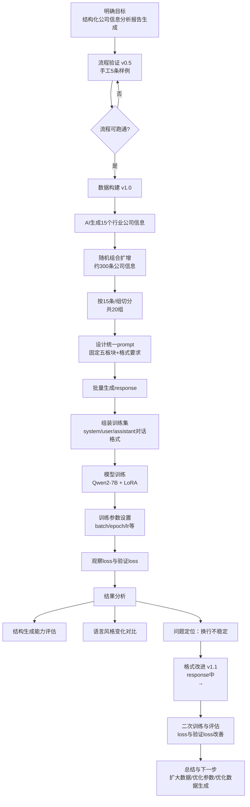
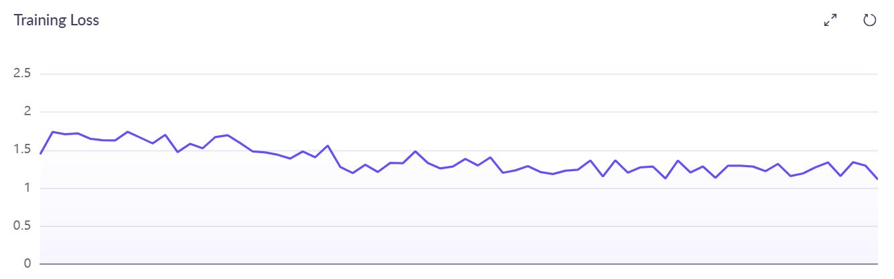

# 基于大语言模型LoRA微调的结构化公司信息分析生成实验报告

---

## 一、实验背景

随着大语言模型（Large Language Models, LLMs）的快速发展，其在文本生成、信息提取与知识分析等任务中的能力不断提升。然而，在实际应用中，大模型往往难以稳定地输出具有固定结构的内容，尤其是在需要按照特定模板生成分析报告的场景中。因此，如何通过少量数据微调，使模型能够稳定输出结构化内容，是一个具有实践意义的问题。

本实验旨在探讨基于少量训练数据和 **LoRA 微调（Low-Rank Adaptation）** 方法，如何使大语言模型生成结构化的公司基本面分析内容。实验的核心目的是：

1. 探讨 **数据清洗与标准化** 在文本生成任务中的重要性；
2. 探讨如何通过 **数据增强** 提升训练集的多样性，并增强模型的泛化能力；
3. 通过 **LoRA 微调** 提升大语言模型的训练效率和生成质量；
4. 分析 **文本格式优化** 对生成结果的影响，特别是 **换行符** 的处理。

---

## 二、实验流程

整个实验流程主要分为三个阶段：流程验证、数据构建与模型微调（总览）。



### 2.1 流程验证（版本 0.5）

在正式构建数据集之前，首先使用少量手工数据验证训练流程是否可行。具体做法是手动编写 5 条样例数据，并将其组织为符合训练要求的格式，通过微调流程进行测试。

通过该阶段实验，成功验证了数据格式、训练流程以及模型加载等步骤能够正常运行，为后续大规模数据构建提供了基础。

---

## 三、数据构建（版本 1.0）

在流程验证完成后，开始构建用于微调的训练数据集。本实验采用 **人工设计 + AI生成** 的方式构建训练数据。

首先，通过 AI 生成 **15 个不同行业的公司信息样本**。在每个行业中，设计多条不同的公司描述，并进行随机组合，以增加数据多样性。具体数据规模如下：

- 行业数量：15
- 每个行业组合生成约 20 条公司信息
- 最终得到公司信息样本：15 \times 20 = 300

随后，将这 300 条公司信息按照 **15 条为一组进行切分**，并为每组信息构造统一的分析提示（prompt）。该 prompt 要求模型根据公司描述生成结构化的公司基本面分析。

之后，将公司信息与提示输入 AI，批量生成对应的分析结果（response）。最终获得：

- prompt：300 条
- response：300 条

将每组 prompt 与其对应的 response 进行匹配，构建出完整的训练数据集。

response生成prompt示例：

```json
**输入规则**
每次输入15条公司信息，每条代表一家公司，严格按照输入顺序处理，绝不改变顺序。
**分析任务**
对每家公司进行分析，拆分为五个板块：【公司概况】【商业模式】【盈利能力】【成长性分析】【风险提示】

**格式要求**

- 小标题与内容在同一行，不换行
- 五个板块逐行排列，板块之间换行不空行
- 公司之间空一行
- 每组最前面写 === 第X组 ===

**内容质量要求**

- 尽量贴合原文，从原文分析，不要自由发挥
- 分析增长驱动因素，有逻辑推导
- 点出最核心、最实质性的风险

**批量规则**

- 每组15条，共20组，300条总量
- 一次处理一组，只输出当前组结果
```

训练数据采用如下对话格式：

```
system: 指定模型的角色和输出结构要求
user: 提供公司信息
assistant: 输出结构化公司分析
```

生成Jsonl数据示例：

```json
{"messages": [{"role": "system", "content": "你是专业金融分析助手。必须严格按照固定结构输出。禁止增加或删除板块标题。禁止改变顺序。必须使用以下结构：【公司概况】【商业模式】【盈利能力】【成长性分析】【风险提示】"}, {"role": "user", "content": "公司旗下知名游戏包括“黎明”“险象杀机”，用户群覆盖全国，建立应急预案处理服务器故障，收入对部分热门游戏依赖较大，推出虚拟商品和皮肤等增值服务，与知名主播合作进行产品推广，增值服务和道具销售贡献主要利润，根据数据调整运营策略和内容更新，游戏类型多样化，覆盖更多用户群体，社交媒体活动提升玩家活跃度，参与公益活动提升品牌形象。"}, {"role": "assistant", "content": "【公司概况】公司拥有“黎明”“险象杀机”知名游戏产品，用户覆盖全国，产品类型多样并积极通过社交媒体与公益活动提升品牌影响力。\n【商业模式】公司通过游戏免费下载吸引用户，并通过虚拟商品、皮肤等增值服务以及与主播合作推广实现商业变现。\n【盈利能力】公司利润主要来自增值服务与道具销售，但收入对部分热门游戏依赖较高。\n【成长性分析】公司通过数据驱动运营策略与内容更新，同时拓展游戏类型以覆盖更广泛用户群体。\n【风险提示】服务器故障、核心产品依赖度较高以及行业竞争激烈可能影响公司稳定运营。"}]}

```

---

## 四、模型训练

本实验在阿里云百炼大模型平台上进行模型微调，选用 **Qwen2-7b** 作为基础模型，并采用 **LoRA（Low-Rank Adaptation）** 方法进行参数高效微调。

LoRA 方法通过在模型中引入低秩矩阵，对少量参数进行训练，从而显著降低训练成本，同时保持较好的微调效果。相比于全参数微调，LoRA 在计算资源和训练时间方面具有明显优势。

训练数据规模为 **300 条样本**。模型通过学习 prompt 与 response 的映射关系，使其能够根据输入的公司描述生成结构化的分析结果。

在训练过程中，平台提供了训练损失（loss）变化曲线，用于观察模型的收敛情况。随着训练进行，loss 值逐渐下降，表明模型逐步学习到了数据中的结构模式和表达方式。

参数设计：

| 参数名称 | 配置 |
| --- | --- |
| **batch_size** | 16 |
| **eval_steps** | 50 |
| **learning_rate** | 2e-5 |
| **lora_alpha** | 16 |
| **lora_dropout** | 0.05 |
| **lora_rank** | 8 |
| **lr_scheduler_type** | linear |
| **lr_warmup_ratio** | 0.05 |
| **n_epochs** | 4 |
| **sequence_length** | 8192 |
| **weight_decay** | 0.01 |

loss曲线：



不足之处在于loss下降不明显，且验证集loss高（2.9）。

---

## 五、实验结果与分析

### 5.1 结构生成能力

经过微调后，模型能够较为稳定地按照指定结构输出公司分析内容。输出结果通常包含预设的多个分析板块，例如：

- 公司概况
- 商业模式
- 行业地位
- 竞争优势
- 风险提示

不过，在当前实验规模下，模型仍然 **依赖 system prompt 中的结构提示**。如果完全移除结构说明，模型有时无法稳定地生成完整的结构化内容。这可能与训练数据规模较小有关。

因此，在当前阶段，模型的结构生成能力主要依赖于：

- system prompt 的结构约束
- 微调数据中的格式模式

未来可以通过增加训练数据规模进一步提升模型的自主结构生成能力。

---

### 5.2 语言风格变化

在对比微调前后的模型输出时，可以观察到明显的语言风格变化。

相比于原始模型，微调后的模型具有以下特点：

1. **表达更加简练**
    
    输出内容更加直接，减少了不必要的扩展描述。
    
2. **更依赖输入文本信息**
    
    模型在生成分析时更倾向于基于原始公司描述，而不是进行过多的推测或扩展。
    
3. **潜在减少幻觉（Hallucination）**
    
    由于模型更加依赖原始文本，生成内容与输入信息的对应关系更加紧密，因此在一定程度上可能降低了生成虚构信息的概率。
    

对比：

prompt：

```json
星途智行科技公司成立于2018年，总部位于深圳，主营智能驾驶解决方案与车载传感器系统研发。公司核心产品包括自动驾驶算法平台和激光雷达设备，主要客户为国内新能源整车厂。近年来，公司通过与多家车企建立战略合作关系，订单数量持续增长。同时，公司持续加大研发投入，占营收比例超过25%，并计划在海外市场设立研发中心。然而，自动驾驶行业技术迭代迅速，监管政策尚未完全明确，行业竞争激烈。
```

原模型回答：

```markdown
【公司概况】 星途智行科技公司成立于2018年，是一家专注于智能驾驶解决方案与车载传感器系统研发的高新技术企业，总部设于深圳。公司的主营业务包括提供自动驾驶算法平台和激光雷达设备，主要服务于国内的新能源汽车制造商。
【商业模式】 星途智行采用B2B（企业对企业）模式，直接面向汽车制造商销售其自主研发的产品和服务。通过与多个知名新能源汽车品牌建立的战略合作伙伴关系，公司能够获得稳定的订单来源，并实现业务规模的持续扩大。
【盈利能力】 虽然未披露具体财务数据，但考虑到公司持续加大研发投入，占营收比例超过25%，以及订单数量的持续增长，可以推测星途智行在保持较高研发投入的同时，具备一定的盈利能力。随着市场份额的提升和技术优势的积累，公司的盈利能力和市场竞争力有望进一步增强。
【成长性分析】 星途智行通过与国内外汽车制造商的合作，已经建立了稳定的业务基础。公司计划在海外市场设立研发中心，这一战略举措将有助于拓展国际市场，增强在全球市场的竞争力。此外，随着自动驾驶技术的快速发展，市场需求有望持续增长，为公司带来广阔的成长空间。
【风险提示】 尽管星途智行在智能驾驶领域展现出了强劲的发展势头，但仍面临多重挑战。首先，自动驾驶行业的技术迭代速度非常快，公司需要不断跟进最新的技术趋势，以保持竞争优势。其次，行业监管政策的不确定性可能影响市场的接受度和法规合规性。最后，激烈的市场竞争使得公司需要在技术创新、成本控制和市场拓展等方面保持高度警惕，以确保持续稳定的发展。
```

训练后模型回答：

```markdown
【公司概况】 北京智联未来科技有限公司成立于2012年，总部位于北京中关村科技园区，是一家专注于人工智能、大数据及企业软件解决方案的研发与销售的企业。公司产品覆盖智能客服、数据分析平台及企业管理系统，客户涵盖金融、零售、制造等多个行业。
【商业模式】 公司通过提供人工智能、大数据及企业软件解决方案为企业客户创造价值，主要通过产品销售、技术服务和订阅服务获得收入。
【盈利能力】 公司财务表现稳健，年营业收入超过5亿元人民币，显示出较强的盈利能力。同时，公司曾获得“年度创新企业奖”和“最佳雇主奖”，品牌影响力不断增强。
【成长性分析】 公司积极拓展海外市场，并与多家国际企业建立合作关系，显示出较强的成长潜力。此外，公司定期组织技术分享会与公益培训活动，有助于持续吸引和培养人才，推动公司持续发展。
【风险提示】 虽然公司财务表现稳健，但仍面临行业竞争加剧、技术更新换代快、客户需求变化等潜在风险。公司需持续关注市场动态和技术发展，以应对可能的挑战。
```

---

## 六、结构格式问题与改进（版本 1.1）

在实验过程中发现，模型在输出结构时存在 **换行格式不稳定的问题**。

具体表现为：

原本训练数据中使用单个换行符：

```
\n
```

用于分隔不同板块，但在模型生成结果中，部分换行会被替换为空格，从而导致多个板块出现在同一行。

为解决该问题，对训练数据进行了简单修改：

将所有 response 中的 **单个换行符 `\n` 替换为双换行符 `\n\n`**。

修改后重新训练模型，结果显示：

- 模型能够稳定生成换行结构
- 各个板块能够正确分行显示

由此推测，大语言模型在生成文本时可能存在 **“吞掉一个换行符”** 的现象，即在概率采样过程中，单个换行符容易被压缩或忽略，而双换行符能够更稳定地保留结构。

这一现象也表明，在进行结构化文本生成任务时，适当增加格式冗余（如双换行）可以提升输出结构的稳定性。

二次训练的loss下降更为显著，验证集loss也较小（0.98），效果优于第一次训练。


---

## 七、方法对比与专业框架

### 7.1 数据清洗与标准化

数据清洗与标准化是机器学习中不可忽视的基本步骤。通过 **文本规范化（Text Normalization）**，我们确保所有公司信息按照相同格式输入到模型中，从而减少了由于数据格式不一致带来的误差。

### 7.2 数据增强

为了弥补数据量不足的缺陷，本实验采用 **数据增强（Data Augmentation）** 的方法，随机组合不同行业和公司信息。这种方法能有效扩展训练数据集，增加样本的多样性，并提升模型的泛化能力。在 NLP 任务中，数据增强是提高模型性能和避免过拟合的常见技术。

### 7.3 LoRA 微调

在微调过程中，采用了 **LoRA（Low-Rank Adaptation）** 方法。LoRA 通过

引入低秩矩阵，极大减少了需要训练的参数数量，从而能够在有限数据和计算资源下有效地完成大模型微调。这种方法特别适合需要 **高效微调** 和 **低计算开销** 的任务。

### 7.4 文本生成中的格式优化

模型生成文本时，存在换行符丢失的问题，经过 **格式控制（Format Control）** 优化，通过增加冗余的换行符 `\n\n` 来确保输出的结构稳定。这种技术属于 **文本生成中的格式优化**，尤其是在生成长文本时，能够保证输出符合预期的结构和排版。

---

## 八、总结

本实验探索了通过 LoRA 微调大语言模型，使其生成结构化公司基本面分析的可行性。实验主要完成了数据构建、模型微调以及输出效果分析。

实验结果表明：

1. 通过约 300 条训练数据，可以使模型初步学习到结构化输出模式；
2. 微调后模型的语言风格更加简洁，并更依赖原始输入文本；
3. 在结构生成方面，模型仍然需要 system prompt 的辅助约束；
4. 输出格式中存在换行被压缩的问题，通过使用双换行可以有效改善。

总体来看，本实验验证了 **小规模数据 + LoRA 微调** 在结构化文本生成任务中的可行性。未来可以通过扩大数据规模、优化数据生成方式、优化参数等方式，进一步提升模型的结构稳定性和生成质量。
